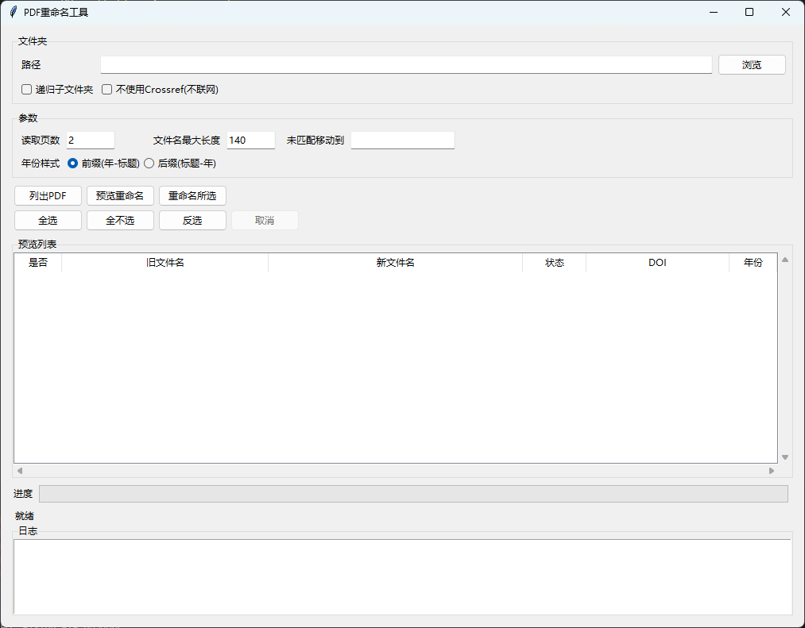

# PDF 重命名工具

基于 PDF 元数据/正文与 DOI（可选 Crossref）自动生成更清晰的文件名，支持 GUI 预览与选择性重命名。

## 功能
- 从元数据或正文提取标题与年份
- DOI 可选联网查 Crossref 获取更准确标题/年份
- 先列出 PDF，再预览重命名结果（不应用）
- 预览后确认重命名，避免误改
- 支持取消预览/重命名任务
- 未匹配标题可移动到指定目录
- 支持递归扫描子文件夹
- 列表支持滚动条，长列表也能完整查看

## 界面预览


## 安装依赖
```bash
pip install pypdf requests
```

## 使用方法（GUI）
```bash
python rename_pdfs_title_year.py
```
或：
```bash
python rename_pdfs_title_year.py --gui
```

GUI 操作步骤：
1. 选择文件夹
2. 点击“列出PDF”
3. 点击“预览重命名”（仅预览，不应用）
4. 勾选需要重命名的文件
5. 点击“重命名所选”
6. 需要中断时点击“取消”

## 使用方法（命令行）
预览（不改名）：
```bash
python rename_pdfs_title_year.py "C:\path\to\pdfs" --dry-run
```

直接改名：
```bash
python rename_pdfs_title_year.py "C:\path\to\pdfs"
```

常用参数：
- `--recursive`：递归扫描子文件夹
- `--no-crossref`：不联网查 Crossref
- `--pages 2`：读取前 N 页提取 DOI/年份
- `--maxlen 140`：文件名最大长度（含 .pdf）
- `--style prefix|suffix`：年份放前/放后
- `--unmatched-dir _unmatched`：标题找不到时移到子目录

## 注意事项
- 大量 PDF 会有一定耗时，GUI 有进度显示，请耐心等待
- 建议先预览确认再重命名
